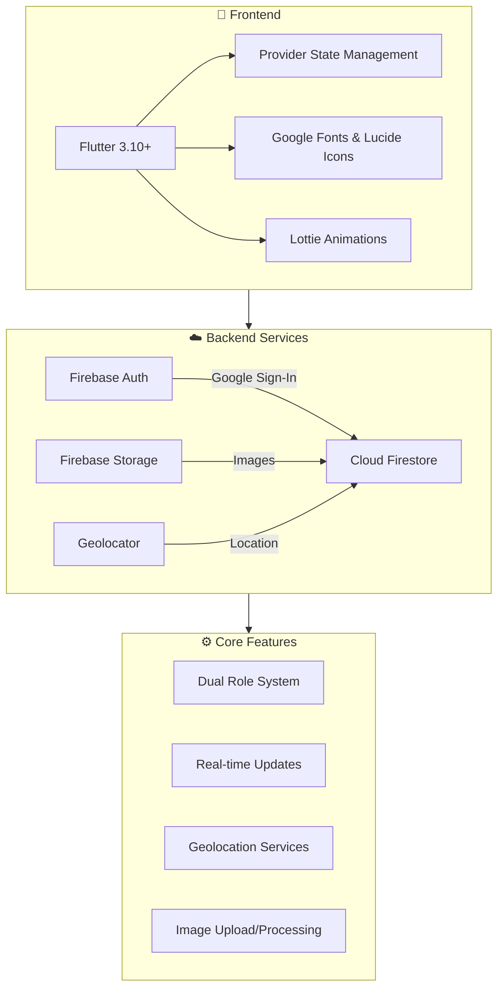

<div align="center">

# 🌟 Rythamo Charity

### *Bridging Hearts, Changing Lives*

A comprehensive Flutter mobile application that revolutionizes how donors connect with orphanages, making charitable giving more transparent, accessible, and impactful.

[](https://flutter.dev)
[](https://firebase.google.com)
[](https://dart.dev)
[](LICENSE)

---

**[View Live Demo](#demo) • [Features](#-key-features) • [Architecture](#-technical-architecture) • [Contact Me](#-get-in-touch)**

</div>

---

## 📖 The Story Behind Rythamo Charity

### The Challenge

In India, there are over **30 million orphaned children** who depend on the generosity of society for their basic needs. Yet, the traditional donation process is often:

- 🔴 **Opaque** — Donors rarely know where their contributions go
- 🔴 **Fragmented** — No centralized platform to discover orphanages nearby
- 🔴 **Inefficient** — Physical donations (clothes, books, food) often go uncoordinated
- 🔴 **Trust-deficient** — Lack of verification leads to skepticism

I witnessed this disconnect firsthand when I tried to donate unused items to a local orphanage. The process was frustrating — no easy way to find verified orphanages, no way to know what they actually needed, and no feedback on whether my donation made an impact.

> *"What if technology could bridge this gap? What if we could create a platform that makes giving as simple as ordering food online?"*

This question sparked the creation of **Rythamo Charity**.

---

### The Solution

Rythamo Charity is a **dual-portal mobile application** that creates a seamless ecosystem connecting:

| **Donors** | **Orphanages** |
|:---:|:---:|
| Discover nearby orphanages | Register and get verified |
| View urgent needs in real-time | Post specific item requests |
| Schedule pickups or drop-offs | Manage incoming donations |
| Track donation history | Update community on needs |

The app transforms charitable giving from a one-way transaction into an **ongoing relationship** between donors and the children they help.

---

## ✨ Key Features

### 🏠 For Donors

<table>
<tr>
<td width="50%">

**🗺️ Orphanage Discovery**
- Interactive map showing nearby verified orphanages
- Distance calculation using Haversine formula
- Detailed profiles with photos, capacity, and urgent needs

**🎁 Smart Donation System**
- Create donation offers with item categories
- Upload photos for transparency
- Choose delivery method (pickup/drop-off)
- Real-time status tracking

</td>
<td width="50%">

**📊 Impact Dashboard**
- Track your donation history
- See lives impacted
- View accepted/pending/rejected offers

**🔔 Urgent Needs Alerts**
- Push notifications for critical needs
- Category-based filtering (food, clothes, education)
- Priority indicators for time-sensitive requests

</td>
</tr>
</table>

### 🏛️ For Orphanages

<table>
<tr>
<td width="50%">

**📝 Profile Management**
- Comprehensive profile setup
- Photo gallery management
- Capacity and occupancy tracking

**📋 Request Broadcasting**
- Post specific item requests
- Set priority levels
- Define quantity needed

</td>
<td width="50%">

**✅ Donation Management**
- Review incoming offers
- Accept/reject with reasons
- Schedule pickups
- Mark donations as completed

**📈 Analytics Dashboard**
- Track donations received
- Monthly/yearly statistics
- Donor engagement metrics

</td>
</tr>
</table>

---

## 🏗️ Technical Architecture

### Technology Stack



### Project Structure

```
lib/
├── core/
│   ├── models/           # Data models (Orphanage, Donation, etc.)
│   ├── providers/        # State management (Theme)
│   ├── services/         # Business logic layer
│   │   ├── auth_service.dart
│   │   ├── donation_service.dart
│   │   ├── orphanage_service.dart
│   │   └── request_service.dart
│   └── theme/            # App theming (Colors, Typography)
│
├── features/
│   ├── auth/             # Login, Signup, Welcome screens
│   ├── onboarding/       # First-time user experience
│   ├── donations/        # Donation creation & management
│   ├── discovery/        # Orphanage exploration
│   ├── orphanage/        # Orphanage dashboard & profile
│   └── requests/         # Item request management
│
├── shared/
│   └── widgets/          # Reusable UI components
│
└── main.dart             # App entry point with AuthGate
```

### Design Patterns

| Pattern | Implementation |
|---------|---------------|
| **Repository Pattern** | Services abstract Firestore operations |
| **Provider Pattern** | State management with `ChangeNotifier` |
| **Factory Pattern** | Model creation from Firestore documents |
| **Auth Gate Pattern** | Role-based navigation handling |

### Key Technical Highlights

- **🔐 Dual Authentication Flow**: Seamless role-based routing for donors vs orphanages
- **📍 Geospatial Queries**: Haversine formula for accurate distance calculations
- **🖼️ Image Optimization**: Firebase Storage with compression and caching
- **🌙 Dark Mode Support**: Complete theme system with dynamic switching
- **📱 Responsive Design**: Adaptive layouts for various screen sizes

---

## 🚀 Getting Started

### Prerequisites

- Flutter SDK 3.10+
- Dart 3.0+
- Android Studio / VS Code
- Firebase account

### Installation

1. **Clone the repository**
   ```bash
   git clone https://github.com/YOUR_USERNAME/rythamo-charity.git
   cd rythamo-charity
   ```

2. **Install dependencies**
   ```bash
   flutter pub get
   ```

3. **Configure Firebase**
   - Create a new Firebase project
   - Enable Authentication (Email/Password + Google)
   - Create Firestore database
   - Generate configuration files:
     ```bash
     flutterfire configure
     ```

4. **Set up environment variables**
   ```bash
   cp .env.example .env
   # Edit .env with your actual values
   ```

5. **Run the app**
   ```bash
   flutter run
   ```

---

## 📸 Screenshots

> *Screenshots coming soon — app demo in development*

<!-- 
<div align="center">
<table>
<tr>
<td></td>
<td></td>
<td></td>
<td></td>
</tr>
<tr>
<td align="center">Onboarding</td>
<td align="center">Home</td>
<td align="center">Discovery</td>
<td align="center">Donate</td>
</tr>
</table>
</div>
-->

---

## 🗺️ Roadmap

- [x] Core donor experience
- [x] Orphanage dashboard
- [x] Donation offer workflow
- [x] Google Sign-In integration
- [x] Dark mode support
- [ ] Push notifications
- [ ] In-app messaging
- [ ] Payment integration for monetary donations
- [ ] Volunteer matching system
- [ ] Impact reports with analytics

---

## 🎯 Lessons Learned

Building Rythamo Charity taught me:

1. **Complex State Management** — Managing dual user roles with real-time updates required careful architecture
2. **Firebase Security Rules** — Implementing role-based access control at the database level
3. **Geolocation UX** — Balancing accuracy with battery consumption
4. **Image Handling** — Compression, caching, and graceful loading states
5. **Empathy-Driven Design** — Understanding both donor and orphanage perspectives

---

## 👨‍💻 Get in Touch

I'm **Vishnu Vardhan M**, a passionate mobile developer focused on building applications that make a positive social impact. I believe technology should serve humanity, and projects like Rythamo Charity are my way of contributing to that vision.

<div align="center">

### 💼 **Open to Opportunities**

I'm actively seeking Flutter development roles where I can contribute to meaningful projects.

<br>

[](https://vishnuvardhanm.vercel.app/)
[](https://www.linkedin.com/in/vishnu-vardhan8055/)
[](mailto:vishnuvardhanthe8055@gmail.com)

</div>

---

## 📄 License

This project is licensed under the MIT License - see the [LICENSE](LICENSE) file for details.

---

<div align="center">

### ⭐ If this project inspires you, consider giving it a star!

*Built with ❤️ using Flutter*

</div>
